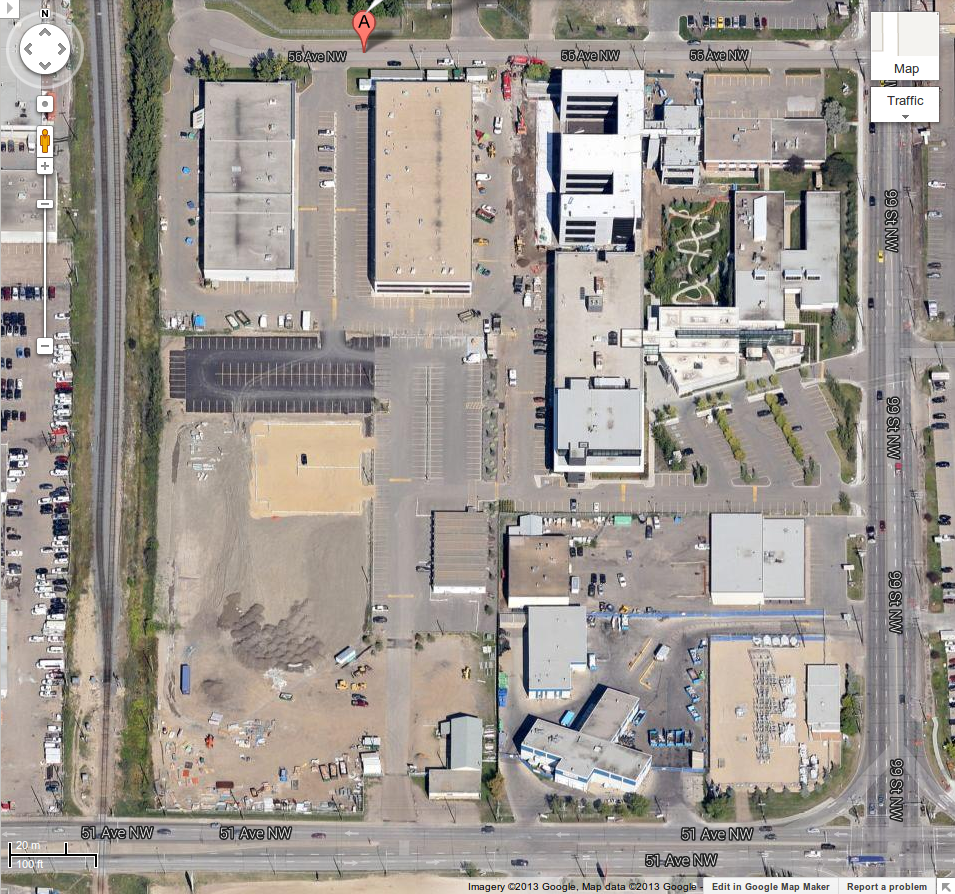

# Making a Life in Edmonton

Useful info, practical advice and helpful organizations to help a hardworking guy with construction trades experience start a new life in Edmonton, the economic powerhouse of Alberta.

## Career Fairs

It might be worth driving out for a career fair even without having a concrete plan in place for moving.

### [Alberta Employment and Career Fair](https://www.albertaemploymentandcareerfair.com/)

>The Alberta Employment and Career Fair is a two day career information and job fair. The fair promotes opportunities for informed career and education planning, and connects employers with employees.
>
>The Alberta Employment and Career Fair is now in its 17th year, and has grown to become Alberta's most comprehensive and best attended career and job fair.
>
>The 2013 fair will feature approximately 200 exhibitors, and attract approximately 10,000 visitors. The 2013 fair will be held Friday October 4th (9am-5pm) and Saturday October 5th (10am-4pm) at the EDMONTON EXPO CENTRE HALL C, 7515 - 118 Avenue in Edmonton Alberta.
>
>The Alberta Employment and Career Fair is a non-profit event. It is free to the public and is funded by the Government of Alberta and the Government of Canada. A substantial portion of the costs are underwritten by organizers, thereby providing exhibitors with tremendous value for their investment

The AECF is particularly interested in people who are looking for training and in people who are unemployed or underemployed i.e. unable to use their most useful skills in their current line of work.

### Trades Employment Show

Trades Employment Show  
Northlands Expo Centre  
7515 118 Avenue  

Wednesday, September 11, 2013  
10:00 am to 6:00 pm  

They only have an [outdated facebook page](https://www.facebook.com/EdmontonJobs/posts/420403354663743), not an actual website, but there was a long list of participants which includes six companies (out of 200) that have "construction" in their name. The [Northern Alberta Institute of Technology](http://www.nait.ca/) attends, and they offer the training for a variety of trades apprenticeships.

If you are quick, clever and lucky, you could find a company at the fair that is hiring apprentices in a trade that you would like to learn, tell them that you are a mobile, hard worker looking for a new trade, and ask them to sponsor you as an apprentice. Then head over to the NAIT booth and set up an apprenticeship in that trade with the company as your sponsor. The timing for this would depend partly on the training course schedule, but the company might hire you as a labourer, because you would presumably be more motivated than someone who was just looking for a labour job, and because you would be familiar with the company by the time the apprenticeship started.

### [Labour Ready](http://www.laborready.com/Temporary-Employment) Job Fair

10:00 a.m. to 1:00 p.m.  
Alberta Works Centre  
Argyll Centre, 6325 Gateway Blvd.  
Edmonton  
Phone: 780-644-5399  

Temp agency with a focus on construction trades. Needs temporary workers to help companies involved in the Calgary disaster relief.

## Potential Employers

### PCL Builders Inc.

Edmonton - Workforce  
10015 56th Avenue NW  
Edmonton, AB T6E 5L7  

General Inquiries: 780-733-6280  
email: EdmontonPBIInquiries@pcl.com  

> In Edmonton, PCL Builders Inc. hires many of the tradespeople who work on project sites in Northern Alberta. It also employs many field personnel, including superintendents, supervisors, foreman, carpenters, laborers, concrete finishers, operating engineers, surveyors, field engineers, and safety professionals.

Currently conducting a recruitment / hiring campaign. The information on their website is poorly organized, so there are probably more opportunities available than those that are visible online. Considering the size of their operations, the high turnover rate in a large city with a strong economy and a methamphetamine problem, and the lack of information about labour jobs, it would be worthwile to drop off a copy of a resume every month until you have something better than what they offer. The company has an internal college, the College of Construction, to help employees advance their careers. I don't think it gets any better than this.

#### Yard Labourer In Nisku
[listing](http://careers.peopleclick.com/careerscp/client_pcl/external/jobDetails.do?functionName=getJobDetail&jobPostId=7705&localeCode=en-us)

Nisku is a small town about 27 KM south of downtown Edmonton.  
Pay: $18.75 / hr + benefits, allowance, paid vacation, RRSP matching.  
Resumes should be delivered in person to PCL head office at the address above.  

##### Qualifications

None listed.

##### Responsibilities

* Material handling
* Shipping/receiving
* Warehousing
* Tool repair
* General yard and shop duties

### [Finning](http://www.finning.ca/)

15810 114 Ave NW  
Edmonton, AB  
(780) 443-7240  

They have about ten facilities spread around north west Edmonton. The address is for what appears to be their main office. Across the road, there is an interesting looking wood products wholesaler, [Match Works](matchworks.ca).

Heavy equipment manufacturer for agricultural, construction, forestry and mining industries. They have an employment category called "Laborer/Washbay/Tool Room/Oil Lab/Painter", but they do not list jobs in this category - the managers probably don't need to post jobs online in order to fill them.

They will have a booth at the Trades Employment Show (above).

### [Labor Ready](http://www.laborready.com/)

10543 107 Ave NW  
North Edmonton
(780) 944-0317  

and

9945 63 Ave NW  
Edmonton  
(780) 944-9403  

Temp agency with two facilities in Edmonton. They serve a wide variety of industries, including warehousing, which is usually a stable, comfortable job with little or no experience required. They desperately need workers for disaster relief in Calgary, but they are only interested in workers who are already in Calgary.

When I lived in Edmonton, Graham got a decent permanent full time labor job through a temp agency with no experience, a grade 10 education, and no equipment in about a week or so.

Be careful on 107th Ave, it was ghetto when I was there. I had a nasty fight with some crack heads because one of them pushed me.

## Resources for Newcomers and Job Seekers

### [Edmonton Economic Development Corporation](http://www.edmonton.com/)

> Alberta is facing a labour shortage of 114,000 workers by the year 2021. Working with industry, EEDC is leading a recruitment initiative. We will be posting for these opportunities on an ongoing basis, holding several interview fairs in different locations throughout the United States.

Offers a high level overview of the economic situation in Edmonton. Their target audience includes skilled trades. In their [economic statistics](http://www.edmonton.com/for-business/edmonton_economic_statistics.aspx), they state that new housing starts grew by 11.6% in April '13, the latest stats available.

## Interesting Publications

Edmonton Business Journal: [Trades Alberta](http://www.edmontonjournal.com/business/tradesalberta/index.html)

[Profile and outlook](http://eae.alberta.ca/documents/profiles/industry-profile-construction.pdf) of the Alberta construction industry, from the Alberta Enterprise and Advanced Education [site](http://eae.alberta.ca/labour-and-immigration/labour-market-information/industry-profiles.aspx).

Carpentry apprenticeship [overview](http://eae.alberta.ca/labour-and-immigration/labour-market-information/industry-profiles.aspx#Apprenticeship_Training), at Alberta Enterprise and Advanced Education. They offer a qualification certificate to become an apprentice carpenter, which accepts prior work experience as a basis for qualification.

[EdmontonJobs](https://www.facebook.com/EdmontonJobs) on Facebook, looks like a government run FB account. There was a post yesterday (July 11th) about laborers needed for restoration in Calgary. Camp work, $17 / hr + overtime, six days a week. Recruiter: Owen Campbell ocampbel@aerotek.com.
